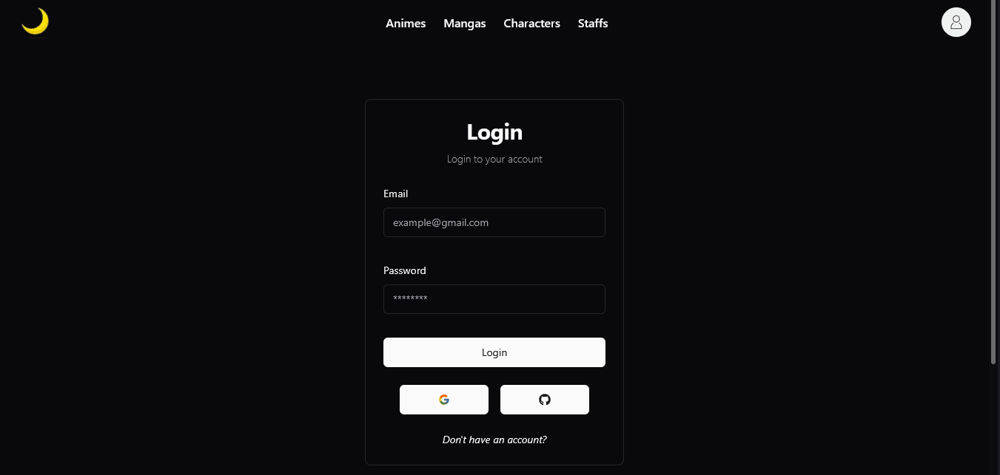

# 🌙 Animoon

Recriado do zero, o Animoon agora conta com novas funcionalidades e melhorias, oferecendo uma interface mais moderna, intuitiva e responsiva.

## Oque é o Animoon?

O Animoon é uma aplicação web com dois principais objetivos:

1. Fornecer informações detalhadas sobre **animes, mangás, personagens e muito mais**.
2. Permitir que os usuários **criem e gerenciem sua própria lista personalizada** de animes e mangás, com todas as informações necessárias para acompanhar seus favoritos.

Essa aplicação foi inspirada nos sites **[MyAniList](https://myanimelist.net/)** e **[Anilist](https://anilist.co/home)**

## Demonstração



### Funcionalidades

- 🔍 **Busca por Títulos**: Pesquise animes e mangás pelo título.
- 🎭 **Busca por Gêneros**: Filtre animes e mangás com base em seus gêneros favoritos.
- 📝 **Detalhes Completos**: Acesse sinopse, personagens, temporadas, pontuações e mais informações sobre cada anime e mangá.
- 📅 **Próximos Lançamentos**: Fique por dentro dos animes e mangás que serão lançados na próxima temporada.
- 🏆 **Animes Populares**: Explore os animes e mangás mais populares, ordenados por classificação.
- 🎉 **Personagens Aniversariantes**: Descubra quais personagens e dubladores estão comemorando aniversário hoje.
- 📱 **Responsividade**: Interface adaptável para dispositivos móveis e desktops.
- 🌙 **Dark Mode**: Alterne entre os modos claro e escuro para uma experiência personalizada.
- 🔑 **Sistema de Autenticação**: Crie sua conta com e-mail e senha ou faça login via Google/GitHub.
- 📌 **Lista Personalizada**: Organize e salve seus animes e mangás favoritos em sua própria lista.
- ⚙️ **Configurações**: Personalize sua experiência ajustando preferências de exibição e conta.

### 🛠️ Tecnologias Utilizadas

- **React.js**: Biblioteca JavaScript para criar interfaces de usuário.
- **Next.js**: Framework React para renderização server-side e rotas dinâmicas.
- **TypeScript**: Superset de JavaScript que adiciona tipagem estática.
- **GraphQL**: Linguagem de consulta usada para comunicar-se com a API do AniList.
- **Authjs**: Biblioteca para autenticação com provedores como Google, GitHub e etc.
- **Prisma**: ORM para Node.js que permite interagir com o banco de dados.
- **NeonDB (PostgreSQL)**: Banco de dados em nuvem para armazenar listas personalizadas e dados do usuário.
- **Tailwind CSS**: Framework CSS utilitário para estilização responsiva.
- **Shadcn**: Biblioteca para criação de componentes de interface acessíveis e estilizados.
- **Apollo Client**: Gerenciamento de requisições GraphQL e cache.
- [**AniList Api**](https://github.com/AniList/ApiV2-GraphQL-Docs): API utilizada para obter informações sobre animes, mangás e personagens.

### 🚀 Instalção

Para rodar o projeto localmente, siga os passos abaixo:

```bash
1. Clone o repositório:

git clone https://github.com/renan22Rsw/Animoon-v2.git

2. Entre no diretório do projeto:

cd animmon

3. Instale as dependências:

npm install
# ou
yarn install
```
